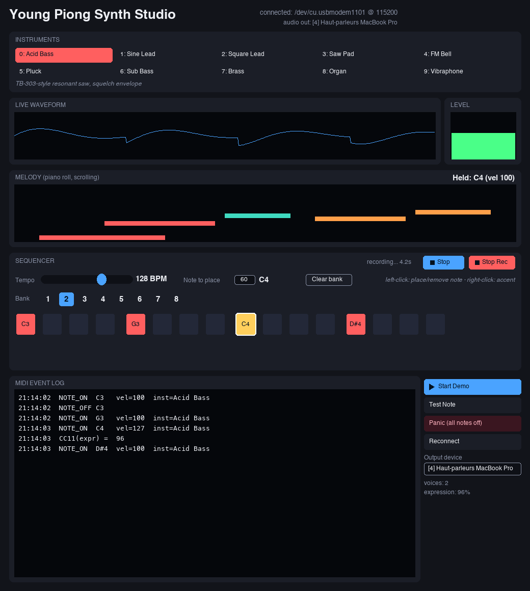

<div align="center">

# YoungPiongMidi

**Real-time voice-to-MIDI converter for the Espressif ESP32-C5**

*Sing a note. It plays a note.*

[](docs/hardware.md)
[](https://docs.espressif.com/projects/esp-idf/)
[](test/README.md)
[](LICENSE)

[Quick start](#-quick-start) ·
[Architecture](#-architecture) ·
[Documentation](#-documentation) ·
[Roadmap](#-roadmap)

</div>

---

YoungPiongMidi listens to a human voice through an analog microphone,
detects its **pitch** and **dynamics** in real time, and turns them into
MIDI so the voice can drive a synthesizer or DAW like any other
instrument. It preserves two musical properties of the voice, not just
"which note":

| Vocal property | Becomes |
|---|---|
| 🎵 **Pitch** | A MIDI note (and, eventually, pitch bend for the continuous glide a fretless voice actually has) |
| 🔊 **Dynamics** | MIDI velocity at note onset, *and* continuous CC11 Expression while the note is held |

> [!TIP]
> New to embedded audio DSP, MIDI, or real-time firmware? **[docs/tutorials/](docs/tutorials/)**
> explains every concept this project uses - sampling, filters, YIN pitch
> detection, state machines, FreeRTOS scheduling, PDM audio - from first
> principles, with diagrams, before showing how this codebase applies it.

## 📊 Status at a glance

| | |
|---|---|
| ✅ **Working, on real hardware, right now** | Mic → pitch → MIDI note → velocity → CC11 → sound, entirely on-device |
| 🔊 **You can already hear it** | Board's own speaker, `tools/acid_synth_monitor.py`, or the full Young Piong Synth Studio GUI (with a built-in sequencer) |
| 🧪 **996 host-side test checks** | No board required - `cd test && make` |
| 🚧 **Not yet implemented** | A wire MIDI transport (BLE/UART) and pitch bend - see [Roadmap](#-roadmap) |

Every item marked done below has been built **and verified on the
physical board**, not just compiled - see [Current status](#-current-status)
for the honest, measured detail (including the real bugs found and fixed
along the way).

## 🚀 Quick start

```sh
# 1. Build
. $IDF_PATH/export.sh
idf.py set-target esp32c5
idf.py build

# 2. Flash and watch it work
idf.py -p /dev/cu.usbmodemXXXX flash monitor

# 3. Run the host-side test suite (no board needed)
cd test && make
```

(On Linux, the serial port is typically `/dev/ttyACM0`. ESP32-C5 uses
native USB-Serial/JTAG, so no external USB-UART bridge or drivers are
needed.) Full detail in [Build & flash](#️-build--flash) below.

## 🏗️ Architecture


Every stage above is **implemented and running today** except the final
hop to an external synth/DAW - `MIDIQ` currently reaches the console
log and the board's own onboard synth, not a wire (BLE/UART are
[Milestones 8-9](#-roadmap)). See `docs/architecture.md` for the full
component map, FreeRTOS task table (priorities, stack sizes, and *why*),
and the reasoning behind every design choice.

## 🔩 Hardware

| | |
|---|---|
| **Board** | Espressif ESP-SensairShuttle v1.0 |
| **MCU / module** | ESP32-C5-WROOM-1-N16R8 (16 MB flash, 8 MB PSRAM) |
| **Microphone** | Analog, pre-amplified on-board, `GPIO6` / ADC1 channel 5 |
| **Display** | ST7789P3, 1.83″, 240×284, 4-wire SPI |
| **Framework** | ESP-IDF v5.5.5 (latest stable with ESP32-C5 support) |

> [!NOTE]
> Every pin used by this firmware is **verified against Espressif's own
> documentation and factory firmware for this exact board**, not
> guessed - see [`docs/hardware.md`](docs/hardware.md) for the full
> sourcing trail.

## 📁 Repository layout

```
main/               App entry point, task wiring
components/
  board/            Pin definitions + central configuration
  audio_capture/    ADC continuous-mode acquisition
  audio_dsp/        RMS, envelope, voice-activity detection
  pitch/            YIN fundamental-frequency detection
  voice_midi/       Frequency<->MIDI note conversion, dynamics->velocity,
                     note-stabilization state machine, CC11 expression
  midi/             Transport-independent MIDI event queue + onboard synth
                     (no BLE/UART transport yet - Milestones 8-9)
  display/          ST7789P3 driver + UI primitives
docs/
  architecture.md, hardware.md, dsp.md, midi.md, tuning.md
  tutorials/        📚 concept-by-concept explanations, from first
                     principles, with diagrams
test/               Host-side tests (real, passing - see test/README.md)
tools/              acid_synth_monitor.py - real-time audio monitor
                    synth_studio.py       - Young Piong Synth Studio: 10-
                                             instrument GUI synth + sequencer
                                             + live waveform/MIDI/melody view
                    sequencer.py          - 8-bank x 16-step sequencer model
                    recorder.py           - WAV recorder
                    midi_link.py          - shared serial-MIDI-log parsing
```

## 🛠️ Build & flash

Requires [ESP-IDF](https://docs.espressif.com/projects/esp-idf/en/latest/esp32c5/get-started/index.html)
v5.5 or later (for ESP32-C5 support).

```sh
. $IDF_PATH/export.sh
idf.py set-target esp32c5
idf.py build
idf.py -p /dev/cu.usbmodemXXXX flash monitor
```

## 🧪 Testing

The frequency↔MIDI-note conversion, RMS, envelope follower, YIN pitch
detector, note-stabilization state machine, dynamics→velocity mapping,
and CC11 expression throttling all have real, hardware-independent unit
tests:

```sh
cd test
make            # builds and runs every suite; fails loudly on any failure
```

No ESP-IDF or board required - see [`test/README.md`](test/README.md)
for what each suite checks. As of this writing: **996 checks across 8
suites, all passing**, including:

- a direct test of the spec's own anti-flicker requirement (*"a small
  pitch fluctuation must not generate Note Off/On/Off/On continuously"*)
- a measured demonstration that the default log-curve velocity mapping
  reads meaningfully higher than a raw linear one at ordinary singing
  levels (the spec's warning against *"poor musical behaviour"* from a
  simple linear mapping)
- an explicit, independent check of the CC11 throttle's two gates (value
  delta **and** minimum interval) - see [`docs/midi.md`](docs/midi.md)
  for why both are required rather than either alone
- a direct test of the adaptive noise gate's key asymmetry (a loud,
  open-gate voice never raises its own threshold; noise the gate never
  trusted eventually does) - see [`docs/dsp.md`](docs/dsp.md)

## 🔊 Hearing MIDI output before Milestone 8/9 exist

There's no wire MIDI transport yet, so two things let you *hear* what
the firmware is deciding, live - both driven by the exact same
`midi_send_*()` calls, both audible the moment a note fires:

<table>
<tr>
<td width="50%" valign="top">

### 🎛️ The board's own speaker

Always on, no setup, nothing to run. `components/midi/onboard_synth.c`
renders every event to a small fixed-point square/PWM voice (velocity →
amplitude, CC11 → pulse width), ~12ms latency budget end to end.

> [!WARNING]
> The mic and speaker sit close together on this board. Loud enough
> playback can be picked back up by the mic and create an audible
> feedback loop - if the board starts self-triggering notes, that's
> what's happening, not a firmware bug.

</td>
<td width="50%" valign="top">

### 🖥️ `tools/acid_synth_monitor.py`

A richer, filtered acid/TB-303-style voice on a connected computer -
useful for the nicer sound or a WAV capture.

```sh
pip install pyserial numpy sounddevice
python3 tools/acid_synth_monitor.py
```

`--self-test` plays a fixed riff with no board needed (isolates audio
routing problems), `--list-devices`/`--device N` pick the output,
`--record-seconds N --wav-out f.wav` captures headlessly.

</td>
</tr>
</table>

Both voices are deliberately simple oscillators, not full synthesizers -
see [`docs/tutorials/07-audio-synthesis-pdm.md`](docs/tutorials/07-audio-synthesis-pdm.md)
for why, including a real numerical-instability bug found (and avoided
on-device) while building the richer Python one.

## 🎹 Young Piong Synth Studio (`tools/synth_studio.py`)

A real-time desktop app (Tkinter, no extra GUI framework needed) that
turns the board's serial MIDI log into a proper playable instrument on
the computer - 10 selectable instruments, a live view of what the board
is doing, and a built-in 8-bank x 16-step sequencer with recording:

```sh
pip install pyserial numpy sounddevice
python3 tools/synth_studio.py
```



> [!NOTE]
> The image above is a **to-scale layout preview**, not a live
> screenshot - this environment cannot reliably capture the real Tk
> window (its own display-session limitation, not a problem with the
> app: the app runs, connects to the board, and produces real audio, all
> verified below). It's generated straight from the app's own layout
> constants/colors/structure, so it matches what actually renders.
> Swapping in a real screenshot is a one-line change - see the alt text
> in `README.md`'s source.

- **10 instruments**, switchable live without interrupting a held note:
  Acid Bass (the same TB-303-style resonant voice as the monitor tool
  above), Sine Lead, Square Lead, Saw Pad, FM Bell, Pluck
  (Karplus-Strong string), Sub Bass, Brass, Organ, Vibraphone.
- **An 8-bank x 16-step sequencer** (`tools/sequencer.py`): left-click a
  step to place the currently-selected note, right-click to accent it,
  pick which of the 8 banks is active, drag the tempo slider (40-240
  BPM), and hit **Play**/**Stop**. Switching banks mid-playback takes
  effect on the next step boundary, like a real hardware sequencer.
  Sequencer notes go through the exact same engine call as a note from
  the board, so they show up in the waveform/log/piano-roll for free.
- **Record** captures whatever's actually coming out of the synth engine
  (sequencer, board, or Demo mode - whatever's playing) to a WAV file
  under `tools/recordings/` (gitignored), named by timestamp.
- **Live waveform**, a VU-style level meter, and a scrolling piano-roll
  of the actual melody being generated - not a mockup, driven by the
  same NOTE_ON/NOTE_OFF/CC log line the onboard synth and
  `acid_synth_monitor.py` read.
- A scrolling **MIDI event log**, an **output-device picker** in the app
  itself (macOS can silently default audio to a disconnected Bluetooth
  device - this makes that visible and one click to fix instead of a
  restart with `--device N`), **Test Note** and **Panic** buttons, and a
  **Demo mode** that plays a fixed riff with no board attached, for
  trying the instruments before singing into the mic.

> [!NOTE]
> This is a GUI application - its window and layout can't be visually
> verified by an automated coding agent with no eyes on the screen
> (that's also why the image above is a generated preview, not a
> screenshot - see its own caption). What *was* verified, all before
> this was ever handed over:
> - **Engine correctness** (`python3 tools/test_synth_engine.py`,
>   headless): all 10 instruments checked for finite/non-silent/
>   non-clipping output, individually and under a full CC11 sweep, plus
>   an adversarial rapid-note-change/voice-stealing stress test - caught
>   two real envelope bugs (FM Bell and Pluck were silently producing
>   zero output).
> - **Sequencer correctness** (`python3 tools/test_sequencer.py`,
>   headless): tempo math, step ordering/gating, accent velocity, bank
>   switching mid-playback, and a real threading race caught and fixed
>   (a fast Stop-then-Play could silently no-op, or - worse - leave an
>   orphaned background thread still firing notes after a restart).
> - **Recorder correctness** (`python3 tools/test_recorder.py`,
>   headless): capture/concatenation, start/stop resets, and that the
>   saved WAV is valid (right sample rate/format, actually contains the
>   audio, clips rather than wraps out-of-range samples).
> - **End-to-end integration**: `synth_studio.py --smoke-test N` opens
>   the real window, connects to the real board over serial, programs a
>   sequencer pattern, plays it, records it, and verifies a non-empty,
>   non-silent WAV came out the other end - all through the exact same
>   code path the UI buttons call.

## 📖 How to use it

Power the board (or plug it into a PC over USB) and watch the console.
Diagnostics print at a rate-limited interval as, e.g.:

```
pitch=440.2Hz note=A4 midi=69 cents=0.8 confidence=0.96 rms=0.13 velocity=84 expr=72 state=NOTE_ACTIVE clipped=0
```

(or `note=---` while confidence is below `YP_PITCH_CONFIDENCE_THRESHOLD`,
0.55 by default). The LCD mirrors the same note/frequency/confidence, a
live level meter, and RMS/status/expression.

Speaking or singing a sustained, clear pitch into the microphone should:

1. Move the level meter and flip `voice_active` to 1
2. Show a note name (e.g. `NOTE A4  +1C`) instead of `NOTE ---`
3. Once held stably for a few frames, produce `midi: NOTE_ON ch=0 note=69 vel=84` -
   the note-stabilization state machine committing a real event
4. Followed by `midi: CC ch=0 cc=11 val=...` lines tracking your voice's
   loudness while the note is held
5. And, at the same moment, real sound from the **board's own speaker**

There is no wire MIDI output yet - events are generated and queued for
real, but the only ways to observe them today are the console log, the
board's own speaker, or the host tool above.

## ✅ Current status

As of the last verification pass (see [`docs/hardware.md`](docs/hardware.md)
and [`docs/tuning.md`](docs/tuning.md) for full detail), this firmware
was built, flashed, and run on a physical ESP-SensairShuttle v1.0 /
ESP32-C5. It boots cleanly, runs a boot self-test (LCD color cycle +
speaker melody), and runs the full
**acquisition → RMS/envelope/VAD/YIN → note-state-machine → CC11-expression
→ MIDI-event-queue → onboard synth** pipeline continuously, with no
crashes and stable memory usage over multi-minute runs.

**Measured, not assumed**: `dsp_task` averages ~4.7ms per 8ms hop
(worst case ~13ms on the YIN-heavy hops, absorbed by the capture queue);
the onboard synth's round-trip audio latency is ~12ms.

> [!IMPORTANT]
> **Real bugs found and fixed along the way, documented rather than
> hidden** (full detail in `docs/tuning.md`):
> - **No hardware FPU on ESP32-C5.** The first all-`float` YIN
>   implementation measured ~79ms/hop against an 8ms budget - fixed with
>   fixed-point arithmetic + decimated analysis.
> - **LCD showed nothing at first boot.** Traced (via Espressif's own
>   schematic, not guessed) to `GPIO5`/`PWR_CTRL` being an
>   active-**low** power switch, driven backwards initially.
> - **Onboard synth audio lagged the MIDI log by ~90ms.** Traced to the
>   I2S driver's default DMA buffer sizing plus an unnecessary
>   task-queue hop - both fixed, verified down to ~12ms.

The note-stabilization state machine's and velocity mapping's *logic* is
verified by 256 of the 996 host-side test checks rather than a live
singing session in any one verification pass - deliberately: their
correctness lives in exact frame-by-frame/millisecond-boundary behavior
that a host test can assert on deterministically and a live mic session
cannot. Hardware runs confirm the *integration* - zero regressions,
every time - which is what hardware verification can actually add on
top of the host tests.

## 🗺️ Roadmap

| # | Milestone | Status |
|---|---|---|
| 1 | Continuous mic acquisition + basic signal display | ✅ Done |
| 2 | RMS/envelope + voice activity detection | ✅ Done |
| 3 | Fundamental frequency detection (YIN) | ✅ Done |
| 4 | Frequency → MIDI note conversion | ✅ Done · tested · verified |
| 5 | MIDI Note On/Off generation | ✅ Done · tested · verified |
| 6 | Vocal dynamics → MIDI velocity | ✅ Done · tested · verified |
| 7 | Continuous CC11 Expression | ✅ Done · tested · verified |
| 8 | BLE MIDI | 🚧 Planned |
| 9 | DIN MIDI over UART (optional) | 🚧 Planned |
| 10 | Pitch bend for continuous vocal pitch | 🚧 Planned |

## 📚 Documentation

| Document | What it's for |
|---|---|
| [`docs/tutorials/`](docs/tutorials/) | **Start here if concepts are new to you.** Sampling, filters, YIN, MIDI, state machines, FreeRTOS, PDM audio - explained from first principles, with diagrams |
| [`docs/architecture.md`](docs/architecture.md) | Component map, FreeRTOS task table, and the design reasoning behind this codebase specifically |
| [`docs/hardware.md`](docs/hardware.md) | Pin sourcing trail, board bring-up, and hardware findings |
| [`docs/dsp.md`](docs/dsp.md) | The DSP pipeline's implementation detail |
| [`docs/midi.md`](docs/midi.md) | The MIDI engine's design and implementation detail |
| [`docs/tuning.md`](docs/tuning.md) | Every real bug found on real hardware, with the measurements behind each fix |
| [`test/README.md`](test/README.md) | What each host-side test suite actually checks |

## 📄 License

MIT - see [`LICENSE`](LICENSE).
