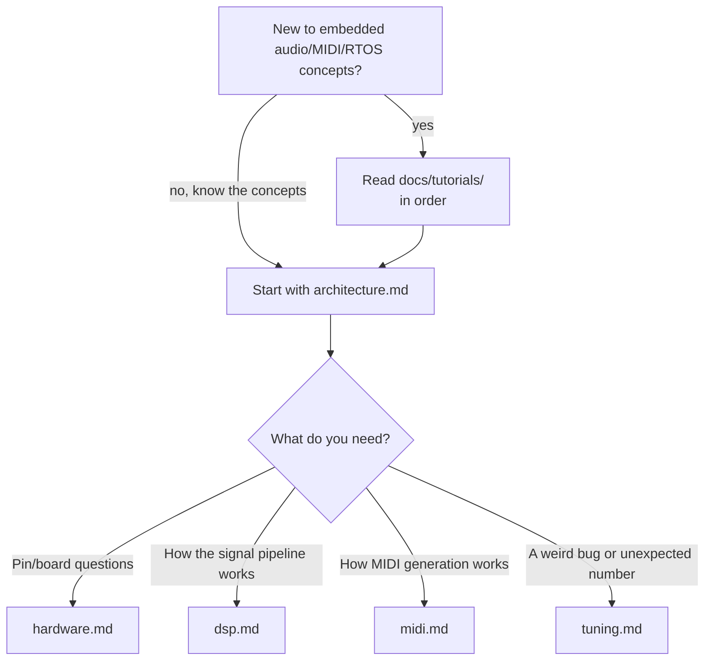

# YoungPiongMidi documentation

Two kinds of documentation live here, for two different questions.

## 🎓 "I don't know what X is - teach me"

**[`tutorials/`](tutorials/)** - a guided series explaining every
concept this project uses, from first principles: sampling and ADCs,
digital filters, RMS and envelope followers, the YIN pitch-detection
algorithm, MIDI's note/velocity/CC model, debouncing and state machines,
FreeRTOS scheduling and real-time design, and PDM audio synthesis. Each
one is grounded in this codebase's actual files and functions, with
diagrams. Read them in order - they build on each other.

## 🔧 "I know the concepts - how does *this project* actually work, and why"

The documents below assume you already know what an envelope follower or
a FreeRTOS queue is (or just read the tutorials above) and explain the
specific decisions, trade-offs, and verified facts behind this codebase:

| Document | Answers |
|---|---|
| [`architecture.md`](architecture.md) | What are the components, what does each own, what are the FreeRTOS tasks and their priorities, and why |
| [`hardware.md`](hardware.md) | Which pin does what, where did that come from, what's been verified on the physical board |
| [`dsp.md`](dsp.md) | How the acquisition → filtering → RMS/envelope → pitch pipeline is actually implemented, and what it costs (measured) |
| [`midi.md`](midi.md) | How the MIDI event model, note-stabilization state machine, velocity/CC11 mapping, and transports are designed |
| [`tuning.md`](tuning.md) | Every real bug found on real hardware - symptom, root cause, fix, and the numbers that prove it |

## Where to start

And the top-level [`../README.md`](../README.md) for build/flash
instructions, current status, and the project roadmap.
