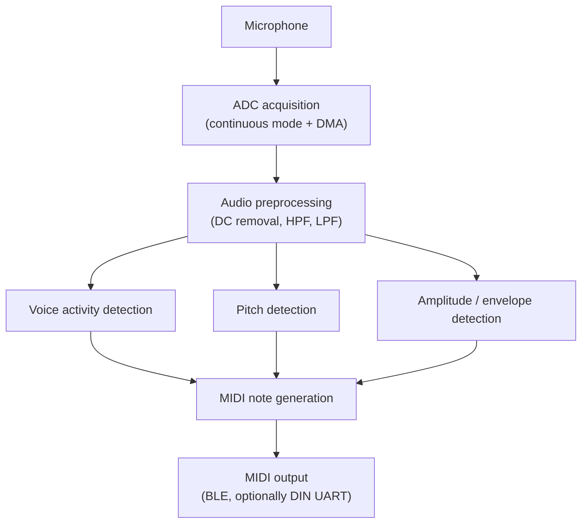
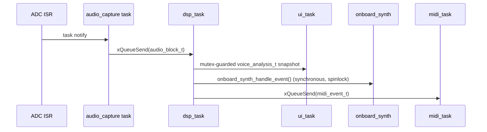

[← Docs index](README.md)

# Architecture

> New to the concepts behind any of this (ADC/DMA, filters, YIN, MIDI,
> state machines, FreeRTOS, PDM)? [`docs/tutorials/`](tutorials/) explains
> each one from first principles before this document assumes you know
> it. See [`docs/README.md`](README.md) for the full documentation map.

## Signal chain (target, end state)



## Component map

```
components/
  board/         Pin definitions (yp_board.h) + central config (yp_config.h).
                 No DSP, no protocol code - just "what pin is what" and
                 "what are the tunable numbers".
  audio_capture/ Owns the ESP-IDF ADC continuous-mode driver. Produces
                 audio_block_t (conditioned, normalized float samples) on
                 a queue. DC removal + a fixed-cutoff HPF happen here,
                 because they are acquisition-layer concerns per the
                 project spec, and because doing them once, close to the
                 ADC, is simpler than repeating them per downstream
                 consumer.
  audio_dsp/     Per-hop analysis: optional LPF -> RMS -> envelope ->
                 voice-activity detection -> pitch (calls into `pitch`).
                 Produces voice_analysis_t. Does not know about MIDI or
                 the display.
  pitch/         YIN fundamental-frequency detector (Milestone 3, done).
                 Fixed-point (not float - see docs/dsp.md/tuning.md for
                 why) for its hot inner loop; narrow samples-in/
                 {frequency_hz,confidence}-out interface so it stays
                 swappable for a different algorithm later.
  voice_midi/    Frequency<->MIDI note conversion (Milestone 4, done -
                 voice_midi.c/.h), the note-stabilization state machine
                 (Milestone 5, done - note_state_machine.c),
                 dynamics->velocity mapping (Milestone 6, done), and
                 continuous CC11 Expression while a note is held
                 (Milestone 7, done - expression.c). All pure math/state,
                 no ESP-IDF dependency, host-tested
                 (test/test_midi_notes.c, test/test_note_state_machine.c,
                 test/test_dynamics.c, test/test_expression.c: 490
                 checks between them). Decides *when*/*what* a MIDI event
                 should be, never touches a queue or transport itself.
  midi/          Transport-independent MIDI event queue + midi_task
                 (Milestone 5, done - midi.h/.c): builds midi_event_t
                 from voice_midi's decisions and dispatches to whichever
                 transport(s) are enabled. BLE/UART aren't yet
                 (Milestones 8-9). Two things happen with every event
                 today regardless: a diagnostic log line, and real audio
                 on the board's own speaker (onboard_synth.c - a small
                 fixed-point square/PWM voice, not a spec milestone but
                 a verification aid, see docs/midi.md for why it has no
                 resonant filter).
  display/       Direct-SPI ST7789P3 driver + tiny bitmap-font UI
                 primitives. Deliberately not a full LVGL/esp_lcd_panel
                 stack - the UI need (section 13 of the spec) is a
                 handful of text fields and a level meter at 10-20 Hz,
                 not a general-purpose GUI.
main/            Task wiring: creates dsp_task and ui_task, starts
                 acquisition, owns the mutex-guarded "latest analysis"
                 hand-off between them. dsp_task also drives the note
                 state machine and calls midi_send_*() - see "FreeRTOS
                 architecture" below for why that's inline rather than
                 its own task.
```

`components/pitch`, `components/voice_midi` and `components/midi` are
all implemented now (see above), covering Milestones 1-7. Milestones
8-10 (BLE, DIN UART, pitch bend) are not started.

## FreeRTOS architecture

| Task | Owned by | Priority | Stack | Wakes on |
|---|---|---|---|---|
| `audio_capture` | `audio_capture` component | 12 (highest) | 8192 B | ADC continuous-mode `on_conv_done` ISR notification |
| `dsp_task` | `main.c` | 11 | 4096 B | `audio_capture_get_block()` (queue receive, 500 ms timeout) |
| `midi_task` | `midi` component | 6 | 3072 B | `midi_event_t` queue receive (blocks indefinitely) |
| `ui_task` | `main.c` | 5 | 3072 B | Fixed period, `YP_UI_REFRESH_RATE_HZ` (15 Hz default) |
| `main_task` (IDF-owned) | ESP-IDF | default | default | runs `app_main()` once, then exits |

Rationale:

- **audio_capture is highest priority** because it is the only task with a
  hard real-time deadline (drain the ADC continuous-mode driver's internal
  pool before it overflows). Its ISR callback does nothing but a task
  notify - all actual work (raw-to-float conversion, DC removal, HPF,
  clip detection) happens in the task, per the project spec's "interrupts
  only move or signal data" rule.
- **dsp_task is next** so RMS/envelope/VAD/pitch analysis is not delayed
  behind UI or MIDI work, but can still be preempted by fresh audio data.
  The note-stabilization state machine and `midi_send_*()` calls
  (Milestone 5) run inline inside `dsp_task`, *not* as their own task,
  despite the spec's architecture diagram showing a separate
  "Voice-to-MIDI State Machine" stage: `yp_note_sm_process()` is a
  handful of float comparisons per hop, not DSP, and `midi_send_*()`
  only does a non-blocking queue send - handing that off to a whole
  extra task/queue pair would add latency and complexity for zero
  behavioral benefit, which is what the spec's own "do not create
  unnecessary tasks" rule is for. The actual transport boundary - where
  a slow/blocking operation could occur - is `midi_task` below, which
  *is* its own task for exactly that reason.
- **midi_task decouples MIDI transport from the DSP path**: dequeuing and
  "transmitting" (today: logging; eventually: a BLE/UART write) happens
  in its own task so a slow or blocked transport can never stall
  `dsp_task`. Priority 6 sits above `ui_task` (a stuck transport
  shouldn't queue up behind LCD drawing) but well below the audio/DSP
  path (12/11) - MIDI output is not a hard real-time deadline the way
  draining the ADC is.
- **ui_task is low priority and rate-limited independently of the DSP
  loop**, per the project spec's "the DSP loop must never wait for the
  display" requirement. It communicates with dsp_task only through a
  mutex-guarded snapshot struct in `main.c`, never through direct calls.

`CAPTURE_TASK_STACK_BYTES` (8192) looks generous for what the task does,
and was arrived at empirically, not guessed: an earlier value of 3072 B
produced a real stack-protection fault on hardware, because the local
`adc_continuous_data_t parsed[YP_AUDIO_DMA_FRAME_SAMPLES]` scratch array
alone is close to 2 KB at the default hop size, plus `ESP_LOGx`'s own
formatting stack use. See `docs/hardware.md` and the comment above the
macro in `audio_capture.c`.

## Threading / data-hand-off model



No component reaches into another's internals; everything crosses a task
boundary through a typed queue, a mutex-guarded struct, or (for
onboard_synth specifically - see docs/tuning.md for why) a synchronous
spinlock-guarded call. Each hand-off has exactly one producer and one
consumer, so no priority-inversion-prone multi-writer state exists today.

## Why display is a direct SPI driver, not esp_lcd_panel/LVGL

Early text rendering used one `display_fill_rect()` (and therefore one
SPI command+data sequence) per glyph pixel cell. That is correct but far
too slow: redrawing two short numeric fields 15 times a second could
enqueue thousands of tiny SPI transactions, and because a busy task never
naturally yields to the idle task, this measurably starved the FreeRTOS
idle task and triggered real task-watchdog resets on hardware (see the
"clean build, but watchdog resets on first hardware run" note in git
history / docs/tuning.md). The fix - render each text line into a small
line buffer first, then issue one SPI window write for the whole line -
cut the SPI transaction count by roughly two orders of magnitude and
resolved it. This is exactly the kind of "verify on the board rather than
assume" failure mode the project spec warns about, kept here as the
documented reason for the current design rather than silently fixed away.

## Roadmap (implementation order)

Matches the project spec's Section 22. Status as of this document:

| # | Milestone | Status |
|---|---|---|
| 1 | Continuous mic acquisition + basic signal display | Done, verified on hardware |
| 2 | RMS/envelope + voice activity detection | Done, verified on hardware |
| 3 | Fundamental frequency detection (YIN) | Done, verified on hardware |
| 4 | Frequency -> MIDI note conversion | Done, host-tested + verified on hardware |
| 5 | MIDI Note On/Off generation | Done, host-tested + verified on hardware |
| 6 | Vocal dynamics -> MIDI velocity | Done, host-tested + verified on hardware |
| 7 | Continuous CC11 Expression | Done, host-tested + verified on hardware |
| 8 | BLE MIDI | Not started |
| 9 | DIN MIDI over UART (optional) | Not started |
| 10 | Pitch bend for continuous vocal pitch | Not started |

See `README.md` for the user-facing status summary.
