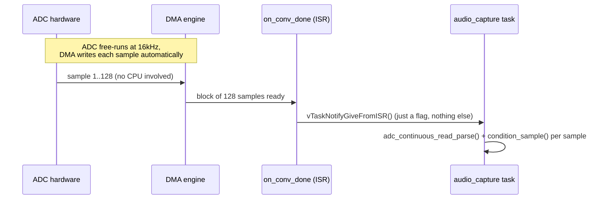

[← Tutorials index](README.md)

# Tutorial 1: Audio acquisition

**Code**: `components/audio_capture/audio_capture.c`

Before any pitch can be detected, sound has to become numbers. This
tutorial covers how a continuous analog voltage from a microphone
becomes a stream of numbers a program can work with, and the first
cleanup steps applied to that stream.

## From air pressure to numbers

A microphone turns air pressure (sound) into a voltage that wiggles up
and down over time. An Analog-to-Digital Converter (ADC) measures that
voltage at regular intervals and outputs a number for each measurement -
this is called **sampling**.

```
Voltage  ^
  |        .--.           .--.
  |       /    \         /    \
  |------/------\-------/------\----> time
  |     /        \     /        \
  |    '          '---'          '

Sampled at fixed intervals:
  |   *    *    *    *    *    *    *   *
      ^ each * is one ADC reading (a number)
```

Two numbers define a sampling setup:

- **Sample rate**: how many measurements per second. YoungPiongMidi uses
  `YP_AUDIO_SAMPLE_RATE_HZ = 16000` (16,000 samples/second). This matters
  because of the **Nyquist theorem**: you can only faithfully capture
  frequencies up to half your sample rate. 16 kHz sampling can represent
  frequencies up to 8 kHz - comfortably more than the 80-1000 Hz range
  this project cares about for a singing voice's fundamental (see
  [Tutorial 3](03-pitch-detection-yin.md)).
- **Bit depth**: how many distinct levels each measurement can take. The
  ESP32-C5's ADC gives a 12-bit reading, i.e. 4096 possible values
  (0-4095) per sample.

## Why "continuous mode," not one reading at a time

The simplest way to use an ADC is to ask it for one reading, wait, ask
again - call it in a loop. This is called **one-shot mode**, and the
project spec explicitly forbids it here: *"Do NOT repeatedly call a
blocking ADC one-shot function to acquire audio."*

The problem is jitter: a software loop's timing is at the mercy of
whatever else the CPU is doing (other tasks, interrupts). At 16,000
samples/second, each sample is only 62.5 microseconds apart - a few
microseconds of unpredictable delay per read already measurably distorts
the signal (this is called **sample jitter**, and it shows up as noise).

The fix is **continuous mode with DMA** (Direct Memory Access): you
configure the ADC hardware once with a target sample rate, and it clocks
itself, writing each result straight into a memory buffer via DMA -
without the CPU lifting a finger for every single sample. The CPU is
only interrupted once a whole *block* of samples is ready, not once per
sample:



Notice the ISR (interrupt service routine - code that runs the instant
the DMA finishes a block) does almost nothing: it just wakes up a task.
All the actual per-sample math happens in that task, at normal task
priority, never inside the interrupt. This matters because an ISR that
takes too long delays *every other interrupt in the system*, including
ones with real deadlines - see [Tutorial 6](06-freertos-realtime.md) for
why that's a hard rule in real-time firmware, not just a style
preference. In code: `audio_capture.c`'s `adc_conv_done_cb()` is the
whole ISR; `capture_task()` is where the real work happens.

## Cleaning up the raw signal

A raw ADC reading is not centered on zero - it sits around some **bias
voltage** (roughly half of full scale, since this board's analog
front-end centers the microphone signal there so it can swing both up
and down without clipping). Two cleanup steps happen before this data is
useful, both in `audio_capture.c`'s `condition_sample()`:

```
raw ADC code (0..4095, centered near 2048)
        |
        v
  DC removal          <- subtract a slowly-tracked average,
        |                 correcting drift over time (temperature,
        |                 supply voltage), not just the nominal midpoint
        v
  High-pass filter     <- remove very low-frequency rumble/handling
        |                  noise a DC tracker alone wouldn't catch
        v
  Normalize to ~[-1, 1]
```

**DC removal**: if you just subtracted a fixed midpoint (2048), you'd be
assuming the bias never drifts. Real circuits do drift slightly. So
instead, the code tracks a *slow-moving average* of the signal (updated
a tiny bit every sample) and subtracts *that* - it adapts to the true
center over time instead of trusting a hardcoded number.

**High-pass filter**: a filter that lets high frequencies through and
attenuates low ones (the opposite is a **low-pass filter** - more on
that in [Tutorial 2](02-dsp-fundamentals.md)). Here it removes rumble
below `YP_AUDIO_HPF_CUTOFF_HZ` (60 Hz) - well below any singing voice,
so nothing musically useful is lost, but mechanical vibration or
electrical hum on the mic line is reduced.

**Clipping detection**: separately, `audio_capture.c` also watches for
raw ADC codes sitting right at the rails (near 0 or near 4095) - a sign
the incoming signal is too loud for the ADC's input range and getting
cut off (**clipped**), the digital equivalent of a distorted, "crunchy"
recording. This gets reported as `audio_block_t.clipped` rather than
silently ignored - see `docs/hardware.md` for a real case where this
flag caught an actual hardware problem.

## Where this data goes next

`audio_capture_task` hands off finished, conditioned blocks of samples
(one hop's worth - see [Tutorial 2](02-dsp-fundamentals.md) for what a
"hop" is) through a FreeRTOS queue to `dsp_task`, which is where
[Tutorial 2](02-dsp-fundamentals.md) picks up.

---
**Next:** [Tutorial 2 - DSP fundamentals →](02-dsp-fundamentals.md)
