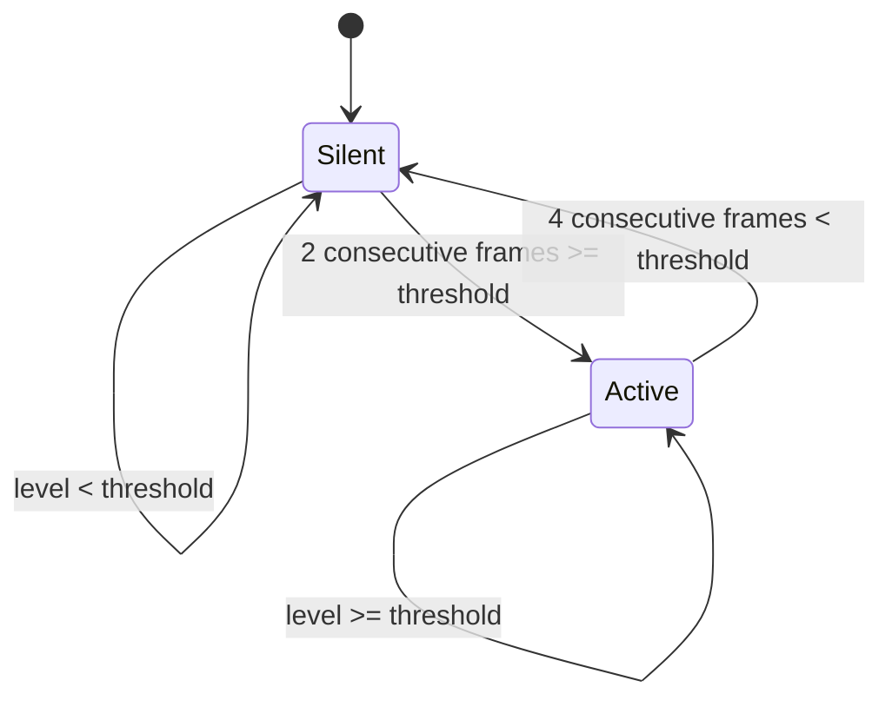

[← Tutorial 1](01-audio-acquisition.md) · [Tutorials index](README.md)

# Tutorial 2: DSP fundamentals - RMS, envelopes, and voice activity

**Code**: `components/audio_dsp/`

By the end of [Tutorial 1](01-audio-acquisition.md) we have a clean
stream of numbers, roughly in `[-1, 1]`, representing the microphone's
signal. This tutorial covers how that stream becomes two much simpler
numbers: "how loud is it" and "is someone actually making sound."

## Frames and hops: analyzing a stream in chunks

You cannot measure "loudness" from a single sample - one number tells
you nothing about a wave's amplitude, only where it happens to be at
that instant. You need to look at a *window* of samples together.

YoungPiongMidi uses two related sizes, both in `yp_config.h`:

- `YP_AUDIO_FRAME_SIZE` (512 samples, 32ms at 16kHz): the size of the
  analysis window.
- `YP_AUDIO_HOP_SIZE` (128 samples, 8ms): how far the window *advances*
  between analyses.

Because the hop is smaller than the frame, consecutive windows
**overlap**:

```
samples:  0    128   256   384   512   640   768
          |-----|-----|-----|-----|-----|-----|
frame 1:  [==========512==========]
frame 2:        [==========512==========]
frame 3:              [==========512==========]
                 ^hop^ ^hop^
```

This gives you a new analysis result every 8ms (fast, responsive)
while each individual analysis still looks at a full 32ms of context
(needed for pitch detection especially - see
[Tutorial 3](03-pitch-detection-yin.md)). A window as short as one hop
alone would be too short to reliably estimate a period; a window that
only advanced by its own full length (no overlap) would only update
every 32ms, adding needless lag.

## RMS: measuring loudness

**RMS** (Root Mean Square) is the standard way to measure a signal's
average energy over a window - and it's *why* it's called that spells
out how to compute it: square every sample (this makes everything
positive and emphasizes big swings), average those squares, then take
the square root to bring the units back to the original scale:

```
RMS = sqrt( (x1^2 + x2^2 + ... + xn^2) / n )
```

Why not just average the absolute values? RMS specifically corresponds
to the physical *power* of a signal (power is proportional to
voltage-squared), which is a better match for perceived loudness than a
plain average - two signals with the same average absolute value can
have very different RMS if one has occasional big spikes. `rms.c`'s
`rms_calculate()` implements exactly the formula above, called once per
hop on the hop's samples (after the low-pass filter in
`audio_dsp.c` - a smoothing step that mostly matters for pitch
detection, mentioned again in [Tutorial 3](03-pitch-detection-yin.md)).

## Envelope followers: smoothing loudness over time

RMS gives you one number per 8ms hop, but that number still jitters
frame to frame - a singer's voice doesn't actually get louder and
quieter 125 times a second, that's measurement noise. An **envelope
follower** smooths this into something that tracks the *real* trend in
loudness, the way a VU meter needle settles rather than flickering.

The trick is to weight each new reading against the *previous* smoothed
value, not just average blindly - and, crucially, to weight it
**differently depending on whether the signal is rising or falling**:

```
new_level = coeff * old_level + (1 - coeff) * new_rms
```

- While rising (a note starting): use a **fast** coefficient (a short
  **attack** time, `YP_ENVELOPE_ATTACK_MS = 8ms`) - you want to catch a
  loud attack quickly, not wait for it to smear out over many frames.
- While falling (a note dying away): use a **slow** coefficient (a
  longer **release** time, `YP_ENVELOPE_RELEASE_MS = 120ms`) - a
  natural voice or instrument doesn't cut off instantly, and reacting
  too fast to every quiet dip makes the output choppy.

```
level
  ^        ___________
  |       /|          |\
  |      / |          | \___
  |     /  |          |     \___
  |    /   |          |         \___
  |   /    |  fast     slow          \___
  |  /     |  attack   release            \___
  +-/------+----------+------------------------> time
```

`envelope.c`'s `envelope_process()` is exactly this, with the two
coefficients precomputed once in `envelope_init()` from the desired
attack/release *times* (not raw coefficients - `yp_config.h` lets you
tune this in milliseconds, which is much easier to reason about than a
raw exponential-decay constant).

This same envelope-followed `level` is what eventually drives MIDI
velocity and CC11 expression - see [Tutorial 4](04-midi-basics.md).

## Voice activity detection (VAD): is anyone speaking?

The last piece is a yes/no decision: is this frame's `level` loud enough
to be voice, or is it just background noise? The naive approach -
`voice_active = (level > threshold)` - has an obvious problem: a level
sitting right at the threshold will flicker true/false/true/false as it
crosses back and forth due to normal jitter, generating spurious
activity toggling.

`audio_dsp.c`'s VAD adds **debouncing**: it requires several consecutive
frames above threshold before declaring "active" (`YP_VAD_ATTACK_FRAMES
= 2`), and several consecutive frames below threshold before declaring
"silence" again (`YP_VAD_RELEASE_FRAMES = 4`) - a single stray loud or
quiet frame can't flip the state on its own.



This exact debouncing idea - don't trust a single frame, require several
in a row before committing to a decision - reappears at a higher level
in [Tutorial 5](05-note-stabilization.md), where it's not just "is there
sound" but "is this specific note real."

## What comes out of this stage

`audio_dsp_process_block()` produces a `voice_analysis_t`: `rms`,
`level`, `voice_active` - plus `frequency_hz`/`confidence`, which is
where [Tutorial 3](03-pitch-detection-yin.md) comes in.

---
**Previous:** [← Tutorial 1 - Audio acquisition](01-audio-acquisition.md)
**Next:** [Tutorial 3 - Pitch detection with YIN →](03-pitch-detection-yin.md)
