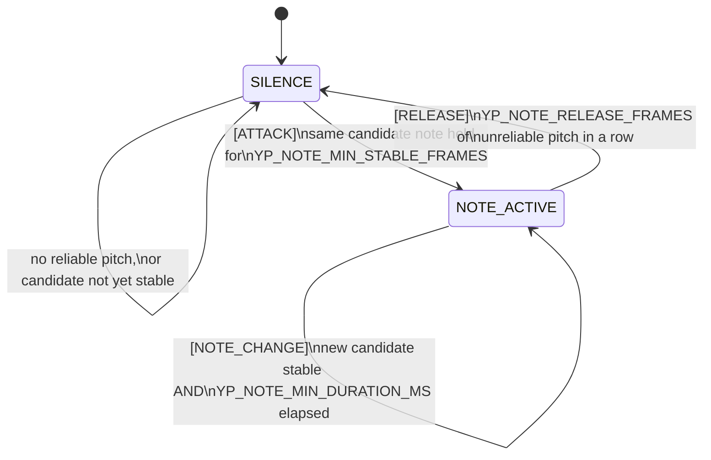

[← Tutorial 4](04-midi-basics.md) · [Tutorials index](README.md)

# Tutorial 5: Note stabilization - debouncing, hysteresis, and state machines

**Code**: `components/voice_midi/note_state_machine.c`

[Tutorial 3](03-pitch-detection-yin.md) produces a new pitch estimate
every 8ms. A human voice is not a laboratory tone generator - it
wavers, has vibrato, and briefly loses confidence between words. If you
turned every raw pitch estimate directly into a MIDI Note On/Off, you'd
get a torrent of flickering, unmusical noise instead of notes. This
tutorial covers the general techniques for turning a noisy, fast signal
into a stable, meaningful decision - and how they're combined here.

## Debouncing: the general problem

"Debouncing" originally refers to a mechanical switch: when you press a
physical button, the metal contacts don't touch cleanly once - they
bounce, making and breaking contact several times in a few milliseconds
before settling. A naive circuit reading that raw signal sees several
rapid on/off/on/off transitions from a single button press.

```
Physical press:   ___/‾‾‾‾‾‾‾‾‾‾‾‾‾‾‾‾‾‾‾‾‾‾‾\___
Raw electrical
signal (bouncing): _/‾\_/‾\_/‾‾‾‾‾‾‾‾‾‾‾‾‾‾‾‾\_/‾\_
                    ^ several spurious transitions
```

The same shape of problem shows up anywhere a noisy real-world signal
crosses a threshold: our own [Tutorial 2](02-dsp-fundamentals.md)'s
voice-activity detector has it (loudness jittering across a threshold),
and pitch estimates have it too (a note hovering near a semitone
boundary can round to either neighbor from frame to frame). The general
fix is always some version of: **don't act on a single reading - require
several consistent readings in a row before committing to a decision.**

## Hysteresis: a second, related idea

**Hysteresis** is a closely related but distinct idea: instead of (or in
addition to) requiring several readings, make it *harder to leave* a
state than it was to enter it. A common example is a thermostat: it
might turn the heat on at 18°C but not turn it back off until 20°C, not
19°C - a single narrow threshold would cause the heater to click on and
off constantly right at the boundary.

```
                 turn OFF here (20C) -->  *
temperature   ---------------------------/---
                                         /
              turn ON here (18C) --> *
```

For pitch, the direct analogue: if a note is being held, don't treat
"the pitch estimate rounds to the neighboring semitone" as an instant
note change - require the new pitch to be clearly, persistently
*outside* a tolerance band around the currently-held note, wider than
the rounding boundary itself. `note_state_machine.c` compares the
*fractional* MIDI note number (not the already-rounded integer) against
`YP_NOTE_CHANGE_TOLERANCE_ST = 0.6` semitones for exactly this reason:
plain integer rounding already groups anything within ±0.5 semitones
into one note, so comparing rounded integers could never express a
tolerance narrower *or* wider than that fixed 0.5 boundary - you need
the fractional value to add real hysteresis on top.

## State machines: giving "debounced" a shape

A **state machine** (or **finite state machine**) is a way of describing
a system that can only be in one of a fixed set of named **states** at a
time, with explicit rules for which states can transition to which
others, and under what condition. Drawing it as a diagram makes "what
can happen next" unambiguous in a way a pile of `if` statements often
isn't.

The project spec calls for five states: `SILENCE`, `ATTACK`,
`NOTE_ACTIVE`, `NOTE_CHANGE`, `RELEASE`. This implementation persists
two of them (`SILENCE`, `NOTE_ACTIVE`) across calls, and represents the
other three as the **transition** between those two, not a separately
stored resting state - `ATTACK` is *the exact call* where enough stable
frames accumulate and a Note On fires, not a state you'd catch the
system sitting in a moment later:



Every arrow above is guarded by a debounce or hysteresis rule from the
previous two sections - none of it is "just because":

- **A frame only counts as "reliable" at all** if voice is active
  *and* YIN's confidence clears `YP_PITCH_CONFIDENCE_THRESHOLD` - the
  same "don't trust a shaky reading" idea from [Tutorial 3](03-pitch-detection-yin.md),
  applied before any of the state logic below even looks at the pitch.
- **Entering `NOTE_ACTIVE` (the `ATTACK` transition)** requires the
  *same* candidate note for `YP_NOTE_MIN_STABLE_FRAMES` consecutive
  reliable frames - classic debouncing.
- **Staying in `NOTE_ACTIVE` through normal vibrato** relies on the
  hysteresis tolerance described above.
- **A genuine `NOTE_CHANGE`** additionally requires the *currently
  held* note to have already lasted `YP_NOTE_MIN_DURATION_MS` - this
  stops two adjacent notes from rapidly trading places if a singer's
  pitch happens to sit exactly between them for a moment.
- **`RELEASE`** requires several consecutive unreliable frames, not
  one - a single dropped/quiet frame mid-note doesn't cut it off.

## Why this matters, concretely

This is the exact mechanism behind the project spec's own worked
example: *"a small pitch fluctuation must not generate: Note Off / Note
On / Note Off / Note On continuously."* `test/test_note_state_machine.c`
turns that sentence into an actual, checked test
(`test_jitter_does_not_flicker`): 60 frames of ±15-cent wobble around a
held note, asserting **zero** additional events fire. That test passing
is what "the hysteresis tolerance works" means in practice, not just in
theory.

## What comes out of this stage

`yp_note_sm_process()` returns a `yp_note_event_t` - `NONE`, `NOTE_ON`,
`NOTE_OFF`, or `NOTE_CHANGE`, each carrying whatever note numbers and
velocity are relevant. `main.c`'s `dsp_task` turns that into actual
`midi_send_*()` calls, which is where
[Tutorial 6](06-freertos-realtime.md) picks up: not *what* MIDI to send,
but how it actually gets delivered, on time, without one part of the
system stalling another.

---
**Previous:** [← Tutorial 4 - MIDI basics](04-midi-basics.md)
**Next:** [Tutorial 6 - FreeRTOS and real time →](06-freertos-realtime.md)
