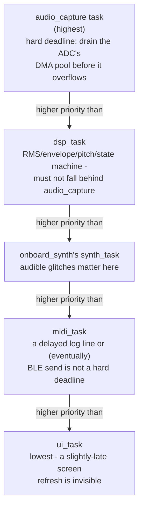
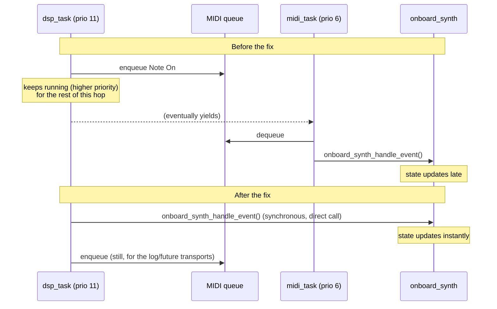

[← Tutorial 5](05-note-stabilization.md) · [Tutorials index](README.md)

# Tutorial 6: FreeRTOS and real time

**Code**: `main/main.c`, `components/audio_capture/audio_capture.c`,
`components/midi/midi.c`, `components/midi/onboard_synth.c`

Everything so far has been about *what* to compute. This tutorial is
about *when* it gets to run - the actual mechanics of "real time" on a
microcontroller, using FreeRTOS (the RTOS - Real-Time Operating System -
this firmware runs on), and a real bug this project hit as a worked
example.

## What "real time" actually means

"Real time" doesn't mean "fast" - it means **predictable timing**: a
system is real-time if it reliably does something *within a required
deadline*, every time, not just usually or on average. A voice-to-MIDI
instrument has a real deadline: audio samples arrive at a fixed rate
(one hop every 8ms - [Tutorial 1](01-audio-acquisition.md)) whether or
not the software is ready for them, and if processing one hop
consistently takes longer than 8ms, the system falls permanently behind
- not just occasionally slow.

A general-purpose OS (like the one on your phone or laptop) optimizes
for overall throughput and fairness across many programs. An RTOS
instead lets you say, explicitly, "this piece of work matters more than
that one, always" - and guarantees the higher-priority work runs first.

## Tasks and priorities

A **task** in FreeRTOS is roughly "a function that runs concurrently
with other tasks," each with its own stack and, critically, its own
**priority** (a number - higher runs first). When more than one task is
ready to run, the scheduler always picks the highest-priority one; a
higher-priority task that becomes ready **preempts** (interrupts) a
lower-priority one that's currently running, without that lower task
getting any say in the matter.

This project's tasks, and the reasoning behind each priority
(`docs/architecture.md` has the authoritative, up-to-date table -
this is the *idea*, not necessarily today's exact numbers):

The rule of thumb: **priority should reflect how bad it is to be late,
not how important the task feels.** Losing audio samples (if
`audio_capture` fell behind) would corrupt everything downstream of it
- catastrophic. A UI frame arriving 50ms late is invisible to a human.

## Interrupts: the one thing above every task

An **ISR** (Interrupt Service Routine) runs when hardware demands
*immediate* attention - here, when the ADC's DMA finishes filling a
buffer ([Tutorial 1](01-audio-acquisition.md)). ISRs run above *every*
task's priority, including the highest one - which is exactly why the
hard rule is to do as little as possible inside one. An ISR that takes
too long delays every task in the system, and every *other* interrupt,
for its entire duration. This project's ADC ISR
(`audio_capture.c`'s `adc_conv_done_cb`) is one line: wake up a task.
All the real work happens in that task, at an ordinary (if high)
priority, where it can itself be preempted if something even more
urgent needs the CPU.

## Queues: handing data between tasks safely

Tasks routinely need to pass data to each other - audio samples from
`audio_capture` to `dsp_task`, MIDI events from `dsp_task` to
`midi_task`. A FreeRTOS **queue** is a thread-safe pipe for this: one
task calls `xQueueSend()`, another calls `xQueueReceive()`, and the
RTOS handles the synchronization so neither task can see the other's
data half-written.

Queues also naturally **decouple** a producer from a slow consumer: the
producer can keep going (up to the queue's capacity) even if the
consumer is momentarily busy elsewhere. This is exactly why
`components/midi/midi.c` queues events for `midi_task`: a future BLE or
UART send (Milestones 8-9) *could* legitimately block for a while (a
busy radio, a full UART buffer), and the queue means that never stalls
the code that decided a note should fire.

But a queue isn't free - handing something off through it means the
receiving task has to actually get *scheduled* before it's acted on, and
that's not instant if a higher-priority task is currently running. This
is not a hypothetical concern - it's exactly what happened next.

## Case study: the onboard synth's real latency bug

When `components/midi/onboard_synth.c` first played MIDI on the board's
own speaker, the sound was audibly *behind* the console's MIDI log - not
"real time." Two separate causes, both found by measuring, not
guessing (see `docs/tuning.md` for the full detail):

**Cause 1 - an unnecessary queue hop.** `onboard_synth_handle_event()`
was originally called from `midi_task`'s queued dispatch - the same path
as the console log. But `dsp_task` (priority 11) enqueuing an event
doesn't *bound* when `midi_task` (priority 6) gets the CPU to act on it
- `dsp_task` can keep running for the rest of its current hop first. A
queue is the right tool for "this consumer might block" (a real BLE
send); it's the wrong tool for "this consumer never blocks, just updates
a few numbers" - there, the hand-off itself is pure added latency with
no corresponding benefit.

The fix: call `onboard_synth_handle_event()` **synchronously**, right
inside `midi_send_*()`, in the *same* task and *same* moment the
decision was made - while *still* separately queuing the event for the
log and any future transport. Two different consumers, two different
needs, two different mechanisms - not one queue trying to serve both.

**Cause 2 - hidden buffering in the audio driver itself.** Even after
fix 1, there was a second delay: the I2S driver's *default* DMA buffer
configuration (`dma_desc_num=6` x `dma_frame_num=240`) holds **1440
audio frames** before any of it reaches the speaker - 90 milliseconds
at 16kHz. `i2s_channel_write()` happily pre-fills that entire pipeline
with already-computed audio before it ever has to wait, so once primed,
there's a steady 90ms gap between "the state updates" and "you hear it,"
no matter how fast step 1 above became. This wasn't a scheduling
problem at all - it was a buffer sized for glitch-free playback in
general, not for *this* application's actual latency budget. Explicitly
sizing it down to 3 buffers of one render-block each (~12ms total) fixed
it - see `onboard_synth.c`'s own comments for the exact numbers and the
underrun-risk trade-off of going even smaller.

**The general lesson**: a task priority table alone does not make a
system real-time. Every hand-off between tasks (a queue) and every
buffer between software and hardware (DMA) adds latency that has to be
sized *for the deadline that actually matters*, not left at whatever a
library's default happens to be - and the only way to know how much
latency any of it actually adds is to measure it on real hardware, the
same principle [Tutorial 3](03-pitch-detection-yin.md)'s fixed-point
story and `docs/tuning.md` keep coming back to.

## Critical sections: protecting a few shared numbers, cheaply

`onboard_synth.c` also has a smaller, different synchronization problem:
`dsp_task` (writing) and `synth_task` (reading, continuously, every
audio sample) both touch a handful of shared numbers - the current
note's pitch, whether a note is held, its velocity. A full queue would
be overkill for "keep five integers consistent" - instead, the code uses
a **spinlock** (`portENTER_CRITICAL`/`portEXIT_CRITICAL`), which
briefly disables interruption for the few instructions it takes to copy
those numbers, then re-enables it. It's called a spinlock because,
conceptually, a second task trying to enter the same protected section
at the same moment would "spin" (busy-wait) until the first one leaves -
acceptable *only* because that section is guaranteed to be a handful of
instructions, never something that could itself block or take a while.
Using a spinlock for something slow would be exactly the ISR mistake
above, self-inflicted in a task instead of an interrupt.

## Where to see all of this at once

`docs/architecture.md`'s "FreeRTOS architecture" section has the current,
authoritative priority table and stack sizes for every task in this
project, with the reasoning for each - this tutorial explains the
*concepts* behind that table; that doc is the source of truth for its
actual current contents.

---
**Previous:** [← Tutorial 5 - Note stabilization](05-note-stabilization.md)
**Next:** [Tutorial 7 - Audio synthesis and PDM output →](07-audio-synthesis-pdm.md)
