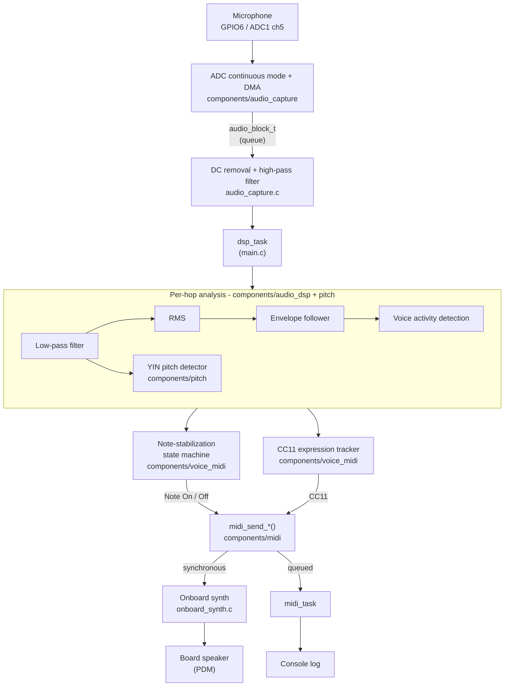

[← Docs index](../README.md)

# YoungPiongMidi tutorials

The rest of `docs/` (`architecture.md`, `hardware.md`, `dsp.md`, `midi.md`,
`tuning.md`) documents *what this project's code does and why it was built
that way* - it assumes you already know what an envelope follower or a
FreeRTOS queue is. These tutorials are the opposite: they teach the
underlying concept first, from first principles, then show exactly where
and how YoungPiongMidi uses it. Read them if you're new to embedded audio
DSP, MIDI, or real-time firmware and want to understand *why* the pipeline
looks the way it does, not just what it does.

Each tutorial is self-contained, but they build on each other in the
order listed - later ones assume you've read the earlier ones.

| # | Tutorial | Covers |
|---|---|---|
| 1 | [Audio acquisition](01-audio-acquisition.md) | Sampling, ADC continuous mode, DMA, DC offset, high/low-pass filters |
| 2 | [DSP fundamentals](02-dsp-fundamentals.md) | RMS, envelope followers, voice activity detection |
| 3 | [Pitch detection with YIN](03-pitch-detection-yin.md) | Autocorrelation, the YIN algorithm, fixed-point vs. floating point |
| 4 | [MIDI basics](04-midi-basics.md) | Note numbers, equal temperament, velocity, CC, the MIDI event model |
| 5 | [Note stabilization](05-note-stabilization.md) | Debouncing, hysteresis, state machines |
| 6 | [FreeRTOS and real time](06-freertos-realtime.md) | Tasks, priorities, queues, critical sections, and a real latency bug as a case study |
| 7 | [Audio synthesis and PDM output](07-audio-synthesis-pdm.md) | Oscillators, envelopes, PDM, DMA buffering and latency |

## The big picture

Every tutorial below zooms into one box of this diagram. This is the
signal path from a sound wave in the air to a sound wave out of the
board's own speaker, with the component/file responsible for each stage:

Two things worth noticing before you dive into the tutorials:

- **Two parallel outputs from the same events.** `midi_send_*()` both
  updates the onboard synth *synchronously* (so it can render sound with
  minimal delay) and *queues* the event for the console log and any
  future transport (BLE/UART, which can legitimately block, so they get
  the safety of a queue). [Tutorial 6](06-freertos-realtime.md) explains
  why those needed different treatment - it's the exact bug that made
  the onboard synth audibly late before it was fixed.
- **Two branches out of the per-hop analysis.** Pitch (YIN) feeds the
  note-stabilization state machine (what note is this?); amplitude
  (RMS/envelope) feeds both that same state machine (how loud was the
  attack?) and, independently, the CC11 tracker (how is the loudness
  changing *right now*, while the note is held?). This split - onset
  dynamics vs. continued dynamics - is the reason [Tutorial 4](04-midi-basics.md)
  and the project spec both treat velocity and CC11 as two different
  things, not one.
